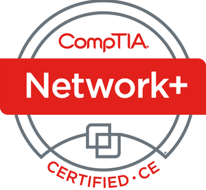

During my time at Coventry University, I explored facets of cybersecurity and ethical hacking, in which I proudly earned a first-class honours. This was followed by a master's degree in the same field of cybersecurity. I became interested in and started practicing computing back in 2014, which continued throughout college. This opened me up to the realm of cybersecurity and, in time, ethical hacking. 

Outside of my academic pursuits, I spend my time gaming, but I also love to learn and study. That's why I decided to create this website—to enable me to possess a virtual space to reflect on my academic journey and progress, primarily my capture the flag events and challenges provided by websites such as TryHackMe.com and HackTheBox.com. This website also allows me to showcase any ongoing projects that I am currently doing. This will serve as a method of tracking my own progression, while also offering the potential to help others who are on similar paths to me. 

I am currently practicing on platforms like Overthewire, RootMe, and pwncollege to enhance my skills and stay up-to-date with the latest security challenges and techniques. Recently, I have advanced my career by becoming a Level 1 SOC Analyst, where I am developing skills in monitoring and responding to security incidents, analyzing threat intelligence, and using various security tools and technologies to protect organizational assets. 

I am well-versed in many areas of IT, and my knowledge in these areas is diverse. From experimenting with web design and programming (Python and C), I am currently attempting to delve deeper with Python and C while also exploring new languages such as Rust, Node/JS, C++, and C#. 

My interests extend beyond coding. I have successfully built computers from scratch and have provided IT support, which encompasses assisting with repairs and supplying basic guides and installs for beginner users. Looking forward, I am determined to enter the field of offensive security, though I remain open to jobs on the defensive security side. My philosophy is simple: "Follow your passions, and success will follow." 

In my leisure time, I am an avid gamer. My favorite game is The Witcher 3, and I have completed a number of Soulsborne games, which speaks to my persistence and strategic thinking skills. 

---
title: "About Jamie" description: "Hello, I’m Jamie; read this page to find out more about me!"
---

Hello, I'm Jamie. I graduated with first-class honours from Coventry University, where I studied Cybersecurity and Ethical Hacking. I became passionate about computing in 2014, leading me to pursue this field throughout college and into my master's degree.

### Academic Achievements
I have undertaken various modules, achieving top grades in each. Some of these include:

__Bachelor's__
- Advanced Network Management and Design
- Systems Security
- Ethical Hacking
- Data Recovery and Advanced Digital Forensic Analysis
- Individual Project
  
__Master's__
- Automotive Cyber Security
- Ethical Hacking
- Intrusion Detection and Response
- Security of Emerging Connected Systems
- Digital Data Acquisition, Recovery and Analysis
- Cyber Security Individual Project
- Cryptography
- Secure Design and Development
- Network Security

If you have any inquiries about my academic or work-based achievements, feel free to contact me on my [LinkedIn](https://www.linkedin.com/in/jamie-gunner/)

### Capture the Flag and Challenges
To enhance my skills, I actively participate in Capture the Flag (CTF) events and challenges on platforms like TryHackMe and Hack The Box. I also practice on Overthewire, RootMe, and pwncollege.

### Current Projects
This website serves as a virtual space to reflect on my academic journey and showcase ongoing projects. It helps me track my progress while potentially assisting others on similar paths.

### Professional Experience
I am currently a Level 1 SOC Analyst, where I focus on monitoring and responding to security incidents, analyzing threat intelligence, and utilizing various security tools to protect organizational assets.

### Skills and Interests
I have a diverse IT skill set, ranging from web design and programming (Python and C) to exploring new languages like Rust, Node.js, C++, and C#. Additionally, I have experience building computers and providing IT support, including repairs and guidance for beginners.

### Future Aspirations
I am determined to enter the field of offensive security, but I remain open to defensive roles. My philosophy is simple: "Follow your passions, and success will follow."

### Hobbies
In my leisure time, I enjoy gaming. My favorite game is The Witcher 3, and I have completed several Soulsborne games, showcasing my persistence and strategic thinking.

### Achievements and Certifications 
I have achieved the following achievements and certifications:

