# Introduction
I have performed my first HackTheBox machine called "Meow", this is of course a starting point box allowing me to get used to using these machines and how they work. I will also be using my own machine to hack these boxes. My current machine is running Parrot OS on VMware. Firstly we must answer a couple of questions before we hack this machine. 
# Task 1 


The first answer is ``Virtual Machine``.

# Task 2
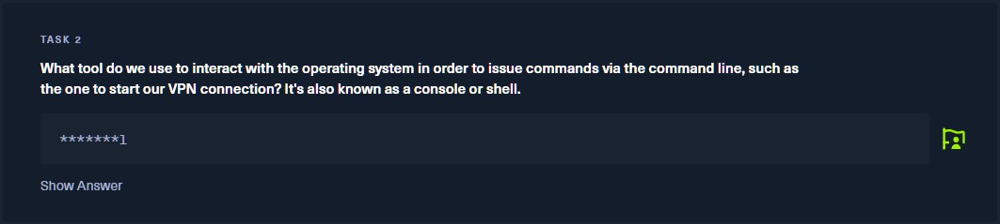
The next answer is ``Terminal``, using Linux it is one of the most common tools that will be used, in order to fulfil tasks. 

# Task 3
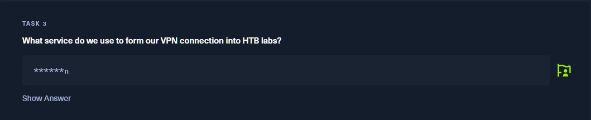
Using HTB and THM you will most likely be using ``OpenVPN`` in order to continue using the boxes. 
# Task 4
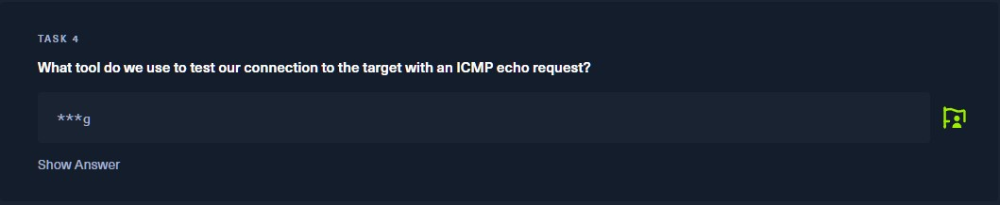
To test our connection with a box you use an ICMP echo request called ``ping``

# Starting point - Ping
The first action you should perform on any of these boxes is  ``ping``  to ensure that you are connect to the box and also HTB. So you will need to perform
```ping machineIP```.

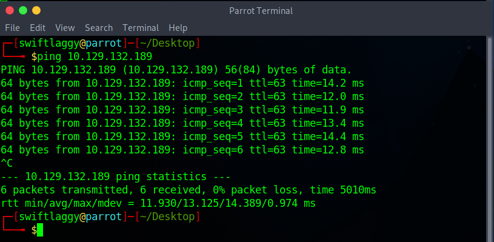

Once we know that the machine is connected we can continue with the machine.

# Task 5 
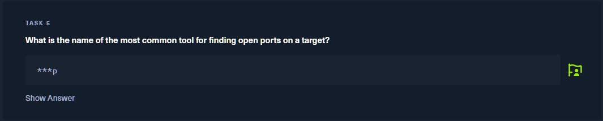
The next tool we will be using is ``nmap``. Nmap gives us plenty of options which we will explore in other boxes that I will complete later on this website. 
# Using Nmap
The next action being taken will be an nmap scan. This scan will consist of using ``-sV``; a scan allowing myself to see the services running on certain ports and their version. I also use  ``-vv``; this allows the scan to increase verbosity significantly. The scan will look like```
nmap -sV -vv machineIP```.

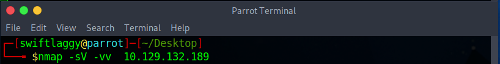


# Nmap Result
Once the scan has finished we will then see a list of results. It is quite long however I have taken a snippet of the most important part. Which will show us the ports and services running on those ports.
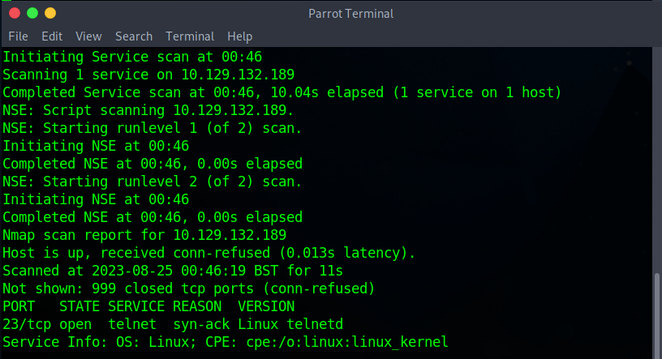

As you can see here, there is only 1 port visibly open and it is telnet which would allow us to answer our next task.

# Task 6
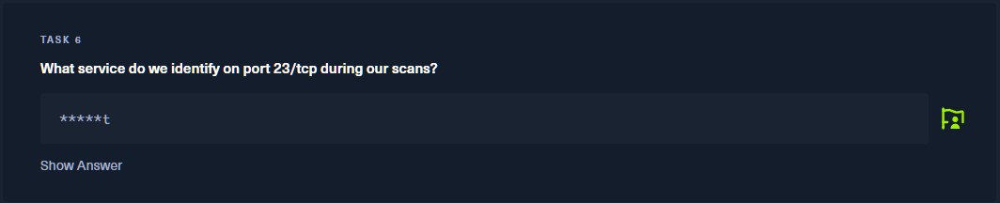

As we can see in the above scan that port 23 is ``telnet`` so therefore we have now answered our next task but we must now set up to use this service to penetrate further into the box. 

# Telnet
We now use the terminal in order to login to telnet using the command ```telnet machineIP```.

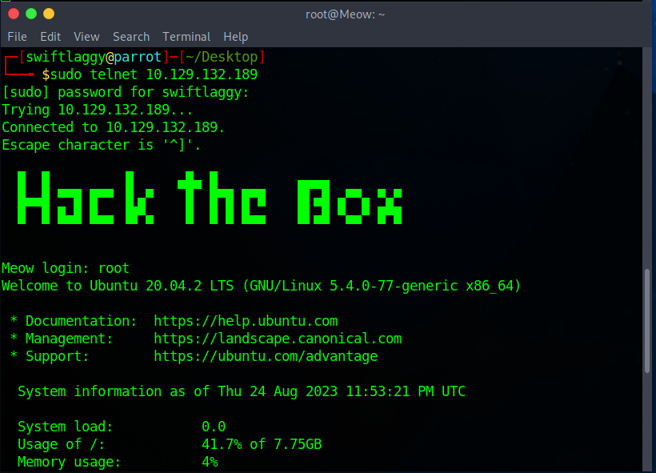

# Task 7
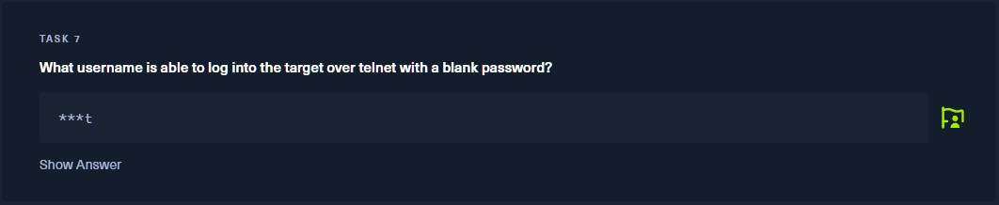
The final answerable question is looking for the username for which does not require a password on telnet which is ``root``.
# Telnet Login
I then login to telnet using the default credential of ``root`` and was instantly allowed access with root privileges we can now access the ``ls`` command to see what files are accessible:

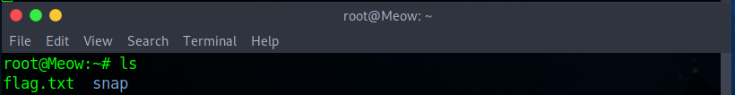

We can clearly see there is a flag.txt file which is what our last task is on HTB, we will need to ``cat`` into this file providing the command ```cat flag.txt```. This will allow us to see the flag

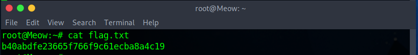

# Finish
This was the final stage to the first box to be done on HackTheBox, it was quite nice and easy and a good introduction with what is to come with this website. Thank you for reading and I hope you have learnt something as well. 
